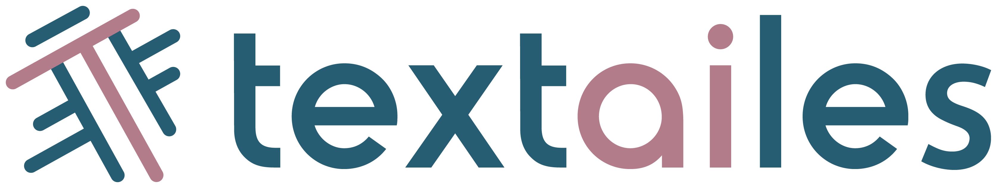
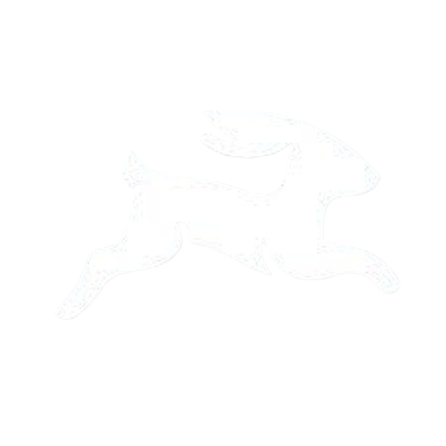
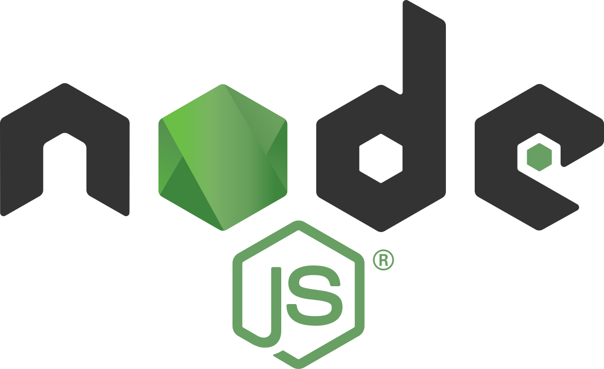

# HESTIA DOCUMENTATION
<!--

    

 -->

## Portal

Portal is a public web page that serves as the digital archive for the [TEXTaiLES](https://www.echoes-eccch.eu/textailes/) project. It is built as a [Directus](https://directus.io/) extension that connects the project database to a public-facing interface, enabling users to:

- Browse and access all digitized cultural heritage artifacts
- View 3D reconstructed models of artifacts using [model-viewer](https://modelviewer.dev/)
- Learn detailed information about each digitized object
- Access direct links to all TEXTaiLES tools
- Log in as an admin user to edit annotations on artifacts through integrated tools

    

    
    
    

